# K8s Microservice

<div align="center">


**A production-ready microservices architecture for CKAD exam preparation and cloud-native learning**

[Getting Started](#-getting-started) •
[Architecture](#-architecture) •
[Kubernetes](#-kubernetes-deployment) •
[CKAD Practice](#-ckad-exam-preparation) •
[Contributing](#-contributing)

</div>

---

## 🌟 **Overview**

This project demonstrates a **polyglot microservices architecture** using multiple programming languages and frameworks, specifically designed for **CKAD (Certified Kubernetes Application Developer)** exam preparation and real-world cloud-native application development.

### **Why This Project?**

- 🎯 **CKAD-Focused**: Every component designed around CKAD exam objectives
- 🔄 **Real Applications**: No toy examples - actual working microservices
- 🌐 **Polyglot Architecture**: Experience diverse technology stacks
- 🚀 **Production Patterns**: Industry-standard practices and configurations
- 🛠️ **Hands-on Learning**: Practice debugging, scaling, and deployment scenarios

---

## 🏗️ **Architecture**

### **Service Overview**

```mermaid
graph TB
    Client[👤 Client] --> Gateway[🌐 Gateway Service<br/>Go - Port 8080]

    Gateway --> User[👤 User Service<br/>NestJS/TypeScript - Port 3001]
    Gateway --> Order[📦 Order Service<br/>Go - Port 8081]
    Gateway --> Payment[💳 Payment Service<br/>Spring Boot - Port 8082]
    Gateway --> Notification[📧 Notification Service<br/>Express.js - Port 3002]

    Order --> Payment
    Order --> Notification

    style Gateway fill:#e1f5fe
    style User fill:#f3e5f5
    style Order fill:#e8f5e8
    style Payment fill:#fff3e0
    style Notification fill:#fce4ec
```



### **Technology Stack**

| Service          | Technology           | Purpose               | Port | Health Check |
| ---------------- | -------------------- | --------------------- | ---- | ------------ |
| **Gateway**      | Go + Gorilla Mux     | API Gateway, Routing  | 8080 | `/health`    |
| **User**         | NestJS + TypeScript  | User Management, Auth | 3001 | `/health`    |
| **Order**        | Go + Gorilla Mux     | Order Processing      | 8081 | `/health`    |
| **Payment**      | Spring Boot + Java   | Payment Processing    | 8082 | `/health`    |
| **Notification** | Express.js + Node.js | Notifications, Events | 3002 | `/health`    |

---

## 🚀 **Getting Started**

### **Prerequisites**

- Docker Desktop
- Kubernetes cluster (minikube, kind, or cloud provider)
- kubectl configured
- Make (optional, for convenience commands)

### **Quick Start - Docker Compose**

```bash
# Clone the repository
git clone git@github.com:Varsilias/k8s-microservice.git
cd k8s-microservice

# Build and start all services
make build
make up

# Test the services
make test

# View logs
make logs
```

### **Quick Start - Kubernetes**

```bash
# tag images
docker tag trader-moni-user-service trader-moni/user-service
docker tag trader-moni-gateway-service trader-moni/gateway-service
docker tag trader-moni-order-service trader-moni/order-service
docker tag trader-moni-payment-service trader-moni/payment-service
docker tag trader-moni-notification-service trader-moni/notification-service

# Load images to minikube (if using minikube)
minikube image load  trader-moni/gateway-service:latest
minikube image load  trader-moni/user-service:latest
minikube image load  trader-moni/order-service:latest
minikube image load  trader-moni/payment-service:latest
minikube image load  trader-moni/notification-service:latest

# Deploy to Kubernetes
cd k8s

kubectl apply -f k8s/namespace.yaml
kubectl apply -f k8s/configmaps/
kubectl apply -f k8s/secrets/
kubectl apply -f k8s/services/
kubectl apply -f k8s/deployments/

# Verify deployment
kubectl get all -n trader-moni

# Access the gateway
kubectl port-forward svc/gateway-service 8080:80 -n trader-moni
```

---

## 📁 **Project Structure**

```
k8s-microservices/
├── 📂 services/                    # Individual microservices
│   ├── 📂 gateway-service/         # Go API Gateway
│   ├── 📂 user-service/           # NestJS User Management
│   ├── 📂 order-service/          # Go Order Processing
│   ├── 📂 payment-service/        # Spring Boot Payments
│   └── 📂 notification-service/   # Express.js Notifications
├── 📂 k8s/                        # Kubernetes manifests
│   ├── 📂 configmaps/             # Environment configuration
│   ├── 📂 secrets/                # Sensitive data
│   ├── 📂 deployments/            # Application deployments
│   ├── 📂 services/               # Service discovery
│   └── 📂 ingress/                # External access
├── 🐳 docker-compose.yml          # Local development
├── 📋 Makefile                    # Convenience commands
└── 📖 README.md                   # This file
```

---

## 🌐 **API Documentation**

### **Gateway Service (Port 8080)**

- `GET /health` - Gateway health check
- `GET /users/*` - Proxy to User Service
- `GET /orders/*` - Proxy to Order Service
- `GET /payments/*` - Proxy to Payment Service
- `POST /notifications/*` - Proxy to Notification Service

### **User Service (Port 3001)**

- `GET /health` - Service health check
- `GET /users` - List all users
- `GET /users/:id` - Get specific user
- `POST /users` - Create new user
- `GET /auth/login` - Simulate authentication

### **Order Service (Port 8081)**

- `GET /health` - Service health check
- `GET /orders` - List all orders
- `POST /orders` - Create new order
- `GET /orders/:id` - Get specific order
- `POST /orders/:id/process` - Process order

### **Payment Service (Port 8082)**

- `GET /health` - Spring Boot health check
- `POST /payments` - Process payment
- `GET /payments/:id` - Get payment status
- `POST /payments/:id/refund` - Refund payment

### **Notification Service (Port 3002)**

- `GET /health` - Service health check
- `POST /notifications/email` - Send email notification
- `POST /notifications/sms` - Send SMS notification
- `GET /notifications/history` - Get notification history

---

## 🐳 **Docker Commands**

### **Development**

```bash
# Build all services
docker-compose build

# Start services in background
docker-compose up -d

# View logs
docker-compose logs -f

# Stop services
docker-compose down
```

### **Individual Service Testing**

```bash
# Test gateway service
docker run --rm -p 8080:8080 trader-moni/gateway-service:latest

# Test user service
docker run --rm -p 3001:3001 trader-moni/user-service:latest
```

---

## ☸️ **Kubernetes Deployment**

### **Deployment Order**

```bash
# 1. Create namespace
kubectl apply -f k8s/namespace.yaml

# 2. Apply configuration
kubectl apply -f k8s/configmaps/
kubectl apply -f k8s/secrets/

# 3. Create services
kubectl apply -f k8s/services/

# 4. Deploy applications
kubectl apply -f k8s/deployments/

# 5. Optional: Setup ingress
kubectl apply -f k8s/ingress/
```

### **Verification Commands**

```bash
# Check deployment status
kubectl get all -n trader-moni

# Check rollout status
kubectl rollout status deployment/gateway-service -n trader-moni

# Check pod logs
kubectl logs -f deployment/gateway-service -n trader-moni

# Port forward for testing
kubectl port-forward svc/gateway-service 8080:80 -n trader-moni
```

### **Configuration Management**

```bash
# Update ConfigMap and restart deployment
kubectl apply -f k8s/configmaps/user-config.yaml
kubectl rollout restart deployment/user-service -n trader-moni

# Scale deployments
kubectl scale deployment user-service --replicas=5 -n trader-moni

# Update container image
kubectl set image deployment/user-service user-service=polyglot/user-service:v2.0.0 -n trader-moni
```

---

## 📚 **CKAD Exam Preparation**

This project covers **all major CKAD exam objectives**:

### **Core Concepts (13%)**

- ✅ Kubernetes API primitives
- ✅ Pods, ReplicaSets, Deployments
- ✅ Namespaces and resource quotas

### **Configuration (18%)**

- ✅ ConfigMaps and Secrets
- ✅ Environment variables
- ✅ Resource requirements and limits
- ✅ Service accounts

### **Multi-Container Pods (10%)**

- ✅ Sidecar, adapter, and ambassador patterns
- ✅ Volume sharing between containers

### **Observability (18%)**

- ✅ Liveness and readiness probes
- ✅ Container logging
- ✅ Monitoring and debugging

### **Pod Design (20%)**

- ✅ Labels, selectors, and annotations
- ✅ Rolling updates and rollbacks
- ✅ Jobs and CronJobs

### **Services & Networking (13%)**

- ✅ Services (ClusterIP, NodePort, LoadBalancer)
- ✅ Ingress controllers and rules
- ✅ NetworkPolicies

### **State Persistence (8%)**

- ✅ Persistent Volumes and Claims
- ✅ Volume types and access modes

---

## 🧪 **Practice Scenarios**

### **Beginner Level**

```bash
# 1. Scale services up and down
kubectl scale deployment user-service --replicas=3 -n trader-moni

# 2. Update environment variables
kubectl patch configmap user-config -n trader-moni -p '{"data":{"LOG_LEVEL":"DEBUG"}}'
kubectl rollout restart deployment user-service -n trader-moni

# 3. Check service health
kubectl exec -it deployment/user-service -n trader-moni -- curl localhost:3001/health
```

### **Intermediate Level**

```bash
# 1. Rolling update simulation
kubectl set image deployment/user-service user-service=polyglot/user-service:v2.0.0 -n trader-moni

# 2. Rollback deployment
kubectl rollout undo deployment/user-service -n trader-moni

# 3. Debug failing pods
kubectl describe pod <pod-name> -n trader-moni
kubectl logs <pod-name> -n trader-moni --previous
```

### **Advanced Level**

```bash
# 1. Network troubleshooting
kubectl exec -it deployment/gateway-service -n trader-moni -- nslookup user-service

# 2. Resource constraint simulation
kubectl patch deployment user-service -n trader-moni -p '{"spec":{"template":{"spec":{"containers":[{"name":"user-service","resources":{"limits":{"memory":"50Mi"}}}]}}}}'

# 3. Multi-service integration testing
kubectl port-forward svc/gateway-service 8080:80 -n trader-moni &
curl -X POST http://localhost:8080/orders -d '{"userId":"123","amount":99.99}' -H "Content-Type: application/json"
```

---

## 🔧 **Troubleshooting Guide**

### **Common Issues**

| Issue                     | Symptoms                          | Solution                                                        |
| ------------------------- | --------------------------------- | --------------------------------------------------------------- |
| **ImagePullBackOff**      | Pods stuck in ImagePullBackOff    | Use `imagePullPolicy: Never` for local images                   |
| **CrashLoopBackOff**      | Pods restarting continuously      | Check logs: `kubectl logs <pod> --previous`                     |
| **Service Unreachable**   | Cannot connect to service         | Verify service selectors match pod labels                       |
| **ConfigMap Not Applied** | Environment changes not reflected | Restart deployment: `kubectl rollout restart deployment/<name>` |

### **Debug Commands**

```bash
# Pod debugging
kubectl get pods -n trader-moni
kubectl describe pod <pod-name> -n trader-moni
kubectl logs <pod-name> -n trader-moni
kubectl exec -it <pod-name> -n trader-moni -- /bin/sh

# Service debugging
kubectl get svc -n trader-moni
kubectl get endpoints -n trader-moni
kubectl describe svc <service-name> -n trader-moni

# Network debugging
kubectl exec -it <pod-name> -n trader-moni -- nslookup <service-name>
kubectl exec -it <pod-name> -n trader-moni -- curl <service-name>:port/health
```

---

## 🎯 **Learning Paths**

### **For CKAD Beginners**

1. Start with Docker Compose setup
2. Deploy individual services to Kubernetes
3. Practice basic kubectl commands
4. Learn ConfigMap and Secret management

### **For CKAD Intermediate**

1. Practice rolling updates and rollbacks
2. Implement health checks and probes
3. Debug failing deployments
4. Configure resource limits and requests

### **For CKAD Advanced**

1. Implement network policies
2. Practice multi-container pod patterns
3. Configure persistent storage
4. Simulate exam scenarios under time pressure

---

## 🚀 **Performance & Production**

### **Resource Recommendations**

| Service      | CPU Request | CPU Limit | Memory Request | Memory Limit | Replicas |
| ------------ | ----------- | --------- | -------------- | ------------ | -------- |
| Gateway      | 50m         | 200m      | 64Mi           | 256Mi        | 2-3      |
| User         | 100m        | 500m      | 128Mi          | 512Mi        | 3-5      |
| Order        | 50m         | 200m      | 64Mi           | 256Mi        | 2-3      |
| Payment      | 200m        | 1000m     | 256Mi          | 1Gi          | 2-3      |
| Notification | 50m         | 200m      | 64Mi           | 256Mi        | 2-3      |

### **Monitoring Integration**

- Prometheus metrics endpoints ready
- Health check endpoints for load balancers
- Structured logging for centralized collection
- OpenTelemetry tracing ready

---

## 🤝 **Contributing**

We welcome contributions! Here's how you can help:

### **Ways to Contribute**

- 🐛 **Bug Reports**: Found an issue? Open a GitHub issue
- ✨ **Feature Requests**: Have an idea? Let's discuss it
- 📚 **Documentation**: Help improve our docs
- 🧪 **CKAD Scenarios**: Add more practice scenarios
- 🔧 **Code Improvements**: Submit pull requests

### **Development Setup**

```bash
# Fork the repository
git clone git@github.com:Varsilias/k8s-microservice.git

# Create feature branch
git checkout -b feature/your-feature-name

# Make changes and test
make build
make test

```

---

## 🙏 **Acknowledgments**

- **CKAD Community**: For exam insights and best practices
- **Cloud Native Computing Foundation**: For Kubernetes and cloud-native standards
- **Open Source Community**: For the amazing tools and frameworks used

---

<div align="center">

**⭐ If this project helped you with your CKAD preparation, please give it a star! ⭐**

Made with ❤️ for the Kubernetes community

</div>
